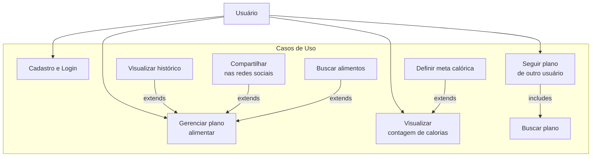
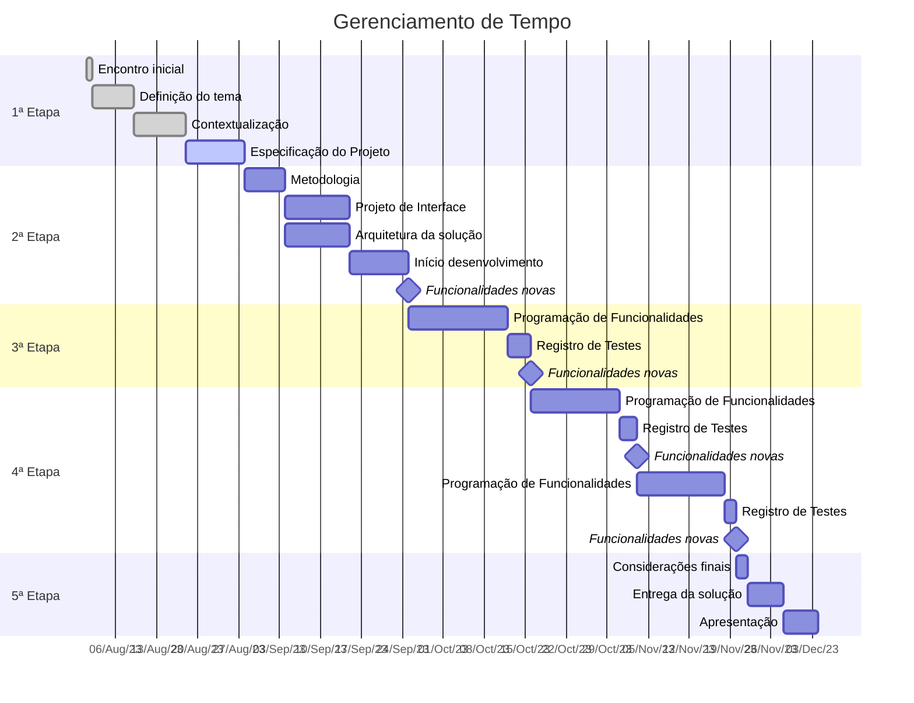
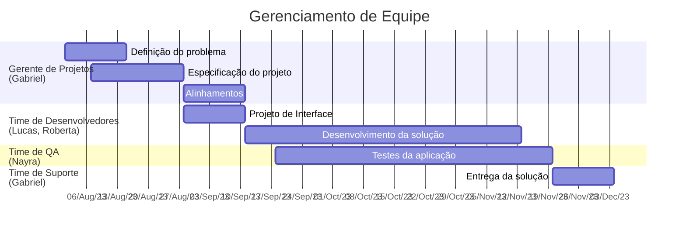

# Especificações do Projeto

A definição do problema e os pontos mais relevantes a serem tratados neste projeto foram consolidados com a participação dos usuários de outros aplicativos, por meio de interações, conversas e entrevistas. As informações coletadas foram organizadas e resumidas em personas e histórias de usuários.

## Personas

As personas levantadas durante o processo de entendimento do problema são apresentadas nas tabelas que se seguem. 

| **Camilla Silva** |      |      |
|------------------------------|------|------|
| | **Idade:** 32 anos  | **Ocupação:** Gerente de Marketing em uma agência de publicidade. |
| **Motivações:** Camilla busca manter um equilíbrio entre sua carreira e saúde. Quer ter mais energia e disposição para lidar com seu trabalho exigente.	| **Frustrações:** Sente-se culpada por não conseguir seguir uma rotina saudável. A falta de tempo a impede de dedicar atenção suficiente à alimentação e atividade física. | **Hobbies, História:** Gosta de ler livros de autoajuda, fazer caminhadas curtas e relaxar assistindo a filmes. |

| **Lucas Pereira** |      |      |
|------------------------------|------|------|
| | **Idade:** 27  anos  | **Ocupação:** Estudante universitário de engenharia. |
| **Motivações:** Lucas quer ter mais energia e concentração para seus estudos. Além disso, deseja melhorar sua aparência física e autoestima.	| **Frustrações:** A falta de conhecimento sobre nutrição e a tentação de escolhas alimentares rápidas e não saudáveis. | **Hobbies, História:** Gosta de praticar esportes como futebol e assistir a séries de TV. |

| **Maria Izabel** |      |      |
|------------------------------|------|------|
| | **Idade:** 45 anos  | **Ocupação:** Nutricionista clínica e esportiva. |
| **Motivações:** Deseja oferecer aos pacientes orientações práticas e acompanhamento eficaz para alcançar suas metas de saúde.	| **Frustrações:** Enfrenta desafios ao manter o contato constante com seus pacientes para fornecer orientações e motivação.| **Hobbies, História:** Gosta de praticar ioga e ler artigos relacionados à saúde e nutrição.|

## Histórias de Usuários

Com base na análise das personas forma identificadas as seguintes histórias de usuários:
|EU COMO... `PERSONA`| QUERO/PRECISO ... `FUNCIONALIDADE` |PARA ... `MOTIVO/VALOR`                 |
|--------------------|------------------------------------|----------------------------------------|
|Camilla Silva       | Deseja uma plataforma onde consiga encontrar a tabela nutricional de vários alimentos. | Para garantir que sua dieta está sendo seguida corretamente. |
|Camilla Silva        | Deseja poder compartilhar suas metas e dietas nas redes sociais. | Para que seus amigos possam acompanhar seu progresso.|
|Camilla Silva     |Deseja uma plataforma onde consiga realizar cadastro no aplicativo  | Para garantir a precisão das informações do seu dia a dia.|
|Lucas Pereira     | Deseja ter acesso a planos de refeições simples e saudáveis para cada semana.| Para Facilitar o planejamento de minhas refeições e evitar a tentação de optar por opções não saudáveis por falta de tempo. |
|Lucas Pereira      | Deseja uma plataforma onde consiga registrar suas refeições de forma rápida e fácil.| Para se manter organizado e evitar fast food. |
|Lucas Pereira      | Deseja deixar como favoritos suas metas atingidas no dia. | Para comparação do seu progresso ao longo dos meses. |
|Maria Izabel       | Deseja uma plataforma onde sejam enviados lembretes personalizados para os pacientes para incentivar a alimentação adequada.| Para garantir que os pacientes estejam seguindo as recomendações. |
|Maria Izabel    |   Deseja que os pacientes recebam notificações quando atingirem marcos importantes em seus objetivos de saúde. | Para celebrar as conquistas dos pacientes e fornecer motivação adicional para continuar em direção a um estilo de vida mais saudável.|
|Maria Izabel       |Deseja que seus pacientes tenham acesso a um contador de calorias que me mostre o valor nutricional de refeições. | Para tomar decisões informadas sobre porções e ingredientes, mantendo o controle de minha ingestão calórica.  |

## Modelagem do Processo de Negócio 

### Análise da Situação Atual

Nos últimos anos, o Brasil tem observado um aumento significativo no número de pessoas preocupadas com a saúde e buscando manter uma alimentação saudável e equilibrada. Muitas vezes isso se torna um grande desafio para a maioria dessas pessoas, visto que, acompanhar o consumo calórico ao longo do dia é difícil, e geralmente, as pessoas não têm uma visão clara de suas metas e realizações. Além de que a falta de organização e o acompanhamento impreciso de calorias e nutrientes podem prejudicar muito o objetivo de um plano alimentar. Senso assim, sem ferramentas adequadas é muito difícil acompanhar o cumprimento das metas nutricionais, visto que, o acompanhamento tradicional é feito de maneira manual e tediosa.

### Processo Atual

### Descrição Geral da Proposta

Resolvemos esses problemas fornecendo aos usuários uma maneira organizada e eficaz de planejar, rastrear e alcançar seus objetivos alimentares e de saúde. Oferecemos um banco de dados de alimentos com informações nutricionais precisas, funcionalidades para registro fácil de refeições, cálculos automáticos de calorias e nutrientes, definição de metas e acompanhamento visual do progresso.
Com nosso aplicativo, os usuários podem fazer escolhas alimentares mais informadas e atingir seus objetivos de saúde de forma mais eficiente do que nas abordagens manuais tradicionais.

### Processo 1 – Login de Usuário

### Processo 2 – Planejamento de refeições

### Processo 3 – Acompanhamento de metas

### Processo 4 – Seguir usuários

## Indicadores de Desempenho

| # | Indicador                                | Objetivos                                 | Descrição                                                | Cálculo                                  | Fonte                                      | Meta                   |
| --- | ---------------------------------------- | ----------------------------------------- | -------------------------------------------------------- | ---------------------------------------- | ------------------------------------------ | ---------------------- |
| 1   | Número de Downloads                      | Aumentar o alcance do aplicativo          | Acompanha o número total de downloads do aplicativo.     | Contagem direta                          | Dados da loja de aplicativos                | Aumento mensal         |
| 2   | Taxa de Retenção de Usuários             | Melhorar a retenção de usuários          | Mede a porcentagem de usuários que retornam ao app.      | [(Usuários Ativos no Mês Atual / Usuários Ativos no Mês Anterior) x 100] | Dados de análise de uso do aplicativo  | > 50%                   |
| 3   | Taxa de Conversão de Cadastro            | Aumentar a conversão de cadastros         | Avalia quantos usuários registrados completam o perfil. | [(Usuários com Perfil Completo / Usuários Registrados) x 100] | Dados de análise de uso do aplicativo  | > 25%                   |
| 4   | Tempo Médio de Uso por Sessão            | Melhorar o envolvimento dos usuários      | Mede quanto tempo, em média, um usuário passa no aplicativo por sessão. | [Tempo Total Gasto no App / Número de Sessões] | Dados de análise de uso do aplicativo  | Aumento mensal         |
| 5   | Taxa de Cumprimento de Metas Diárias     | Aumentar o uso das funcionalidades de metas | Avalia quantos usuários definem e cumprem suas metas diárias. | [(Usuários Cumprindo Metas / Usuários Definindo Metas) x 100] | Dados do aplicativo                     | > 50%                   |

## Requisitos

As tabelas que se seguem apresentam os requisitos funcionais e não funcionais que detalham o escopo do projeto. Para determinar a prioridade de requisitos, aplicar uma técnica de priorização de requisitos e detalhar como a técnica foi aplicada.

### Requisitos Funcionais

|ID     | Descrição do Requisito  |Prioridade |
|-------|-------------------------|----|
|RF-01| Os usuários devem poder fazer cadastro e login usando suas credenciais. | Alta |
|RF-02| Os usuários devem ser capazes de criar e salvar seus planos alimentares, incluindo refeições, alimentos consumidos e quantidades. | Alta |
|RF-03| O aplicativo deve calcular e exibir a contagem total de calorias para o dia com base nos alimentos registrados.	| Alta |
|RF-04| Os usuários devem poder pesquisar e visualizar os planos alimentares de outros usuários. | Alta |
|RF-05| Os usuários devem poder pesquisar alimentos e suas calorias. | Média |
|RF-06| O aplicativo deve enviar notificações push para lembrar os usuários das refeições. | Média |
|RF-07| Os usuários podem definir metas de consumo calórico diário. | Baixa |
|RF-08| Os usuários devem ter acesso a um histórico de planos alimentares anteriores e informações nutricionais. | Baixa |
|RF-09| Os usuários podem compartilhar seus planos alimentares ou conquistas nas redes sociais. | Baixa | 

### Requisitos não Funcionais

|ID     | Descrição do Requisito  |Prioridade |
|-------|-------------------------|----|
|RNF-01| O sistema deve ser fácil de usar, intuitivo e ter uma interface amigável para os usuários | Alta | 
|RNF-02| O sistema deve ser responsivo, permitindo a visualização em diferentes tamanhos de telas.  |  Média | 
|RNF-03| O sistema deve garantir a privacidade e a segurança das informações dos usuários |  Alta | 
|RNF-04| O sistema deve ser fácil de manter, atualizar e corrigir, sem afetar a disponibilidade ou a qualidade do serviço  | Baixa | 
|RNF-05| O sistema deve ser compatível com os principais sistemas operacionais (Android e o iOS)  |  Média | 

### Priorização de Requisitos

A técnica para priorização de requisitos utilizada foi a Escala de Três Níveis e a imagem abaixo retrata a análise realizada.
    

## Restrições

O projeto está restrito pelos itens apresentados na tabela a seguir.

|ID| Restrição                                             |
|--|-------------------------------------------------------|
|RE-01| O projeto deverá ser entregue no final do semestre letivo, não podendo extrapolar a data de 04/12/2023 |
|RE-02| O sistema deve se restringir às tecnologias de React Native |
|RE-03| A equipe não pode subcontratar o desenvolvimento do trabalho   |

## Diagrama de Casos de Uso

# Matriz de Rastreabilidade

A matriz de rastreabilidade é uma ferramenta usada para facilitar a visualização dos relacionamento entre requisitos e outros artefatos ou objetos, permitindo a rastreabilidade entre os requisitos e os objetivos de negócio.

|                     | Cadastro e Login | Registro de Plano Alimentar | Pesquisar Planos de Usuário | Definir Metas e Restrições | Visualizar Histórico | Compartilhar em Redes Sociais | Receber Notificações |
|---------------------|:----------------:|:---------------------------:|:---------------------------:|:------------------------:|:-------------------:|:---------------------------:|:-------------------:|
| Cadastro e Login |-|-|-|-|-|-|-|
| Registro de Plano Alimentar |-|-|X|-|X|X|X|
| Pesquisar Planos de Usuário |-|X|-|-|-|-|-|
| Definir Metas e Restrições  |-|-|-|-|-|-|X|
| Visualizar Histórico |-|X|-|-|-|-|-|
| Compartilhar em Redes Sociais |-|X|-|-|-|-|-|
| Receber Notificações |-|X|-|X|-|-|-|

A matriz ainda não rastreou todos os artefatos da aplicação pois existem documentações e codificações pendentes. Assuntos como casos de teste e diagramas ainda não estão previstos nessa versão da matriz, mas serão implementados ao serem criados.

# Gerenciamento de Projeto

De acordo com o PMBoK v6 as dez áreas que constituem os pilares para gerenciar projetos, e que caracterizam a multidisciplinaridade envolvida, são: Integração, Escopo, Cronograma (Tempo), Custos, Qualidade, Recursos, Comunicações, Riscos, Aquisições, Partes Interessadas. Para desenvolver projetos um profissional deve se preocupar em gerenciar todas essas dez áreas. Elas se complementam e se relacionam, de tal forma que não se deve apenas examinar uma área de forma estanque. É preciso considerar, por exemplo, que as áreas de Escopo, Cronograma e Custos estão muito relacionadas. Assim, se eu amplio o escopo de um projeto eu posso afetar seu cronograma e seus custos.

## Gerenciamento de Tempo

Com diagramas bem organizados que permitem gerenciar o tempo nos projetos, o gerente de projetos agenda e coordena tarefas dentro de um projeto para estimar o tempo necessário de conclusão.

O gráfico de Gantt ou diagrama de Gantt também é uma ferramenta visual utilizada para controlar e gerenciar o cronograma de atividades de um projeto. Com ele, é possível listar tudo que precisa ser feito para colocar o projeto em prática, dividir em atividades e estimar o tempo necessário para executá-las.

## Gerenciamento de Equipe

O gerenciamento adequado de tarefas contribuirá para que o projeto alcance altos níveis de produtividade. Por isso, é fundamental que ocorra a gestão de tarefas e de pessoas, de modo que os times envolvidos no projeto possam ser facilmente gerenciados. 

## Gestão de Orçamento

| ID | Recurso               | Quantidade | Custo Unitário | Custo Mensal | Custo Semestral |
|----|-----------------------|------------|----------------|--------------|-----------------|
| **1**  | **Recursos Humanos**      |            |                |              |                 |   
|    | Gestor de Projetos    | 1          | R$ 15.000,00   | R$ 15.000,00 | R$ 90.000,00    |   
|    | Desenvolvedor / QA    | 2          | R$ 10.000,00   | R$ 20.000,00 | R$ 120.000,00   |   
|    | Designer UX/UI        | 1          | R$ 6.000,00    | R$ 6.000,00  | R$ 36.000,00    |   
|    | Cursos e Treinamentos | 4          | R$ 500,00      | R$ 2.000,00  | R$ 12.000,00    |   
| **2**  | **Hardware**              |            |                |              |                 |  
|    | Notebook              | 4          | R$ 5.000,00    | -            | R$ 20.000,00    |   
|    | Periféricos           | 4          | R$ 500,00      | -            | R$ 2.000,00     |   
| **3**  | **Software**              |            |                |              |                 |   
|    | Licenças              | 4          | R$ 400,00      | R$ 1.600,00  | R$ 9.600,00     |   
| **4**  | **Serviços**              |            |                |              |                 |   
|    | Azure                 | 1          | R$ 2.500,00    | R$ 2.500,00  | R$ 15.000,00    |
|    |                       |            | **Total**          | **R$ 47.100,00** | **R$ 304.600,00**   |

