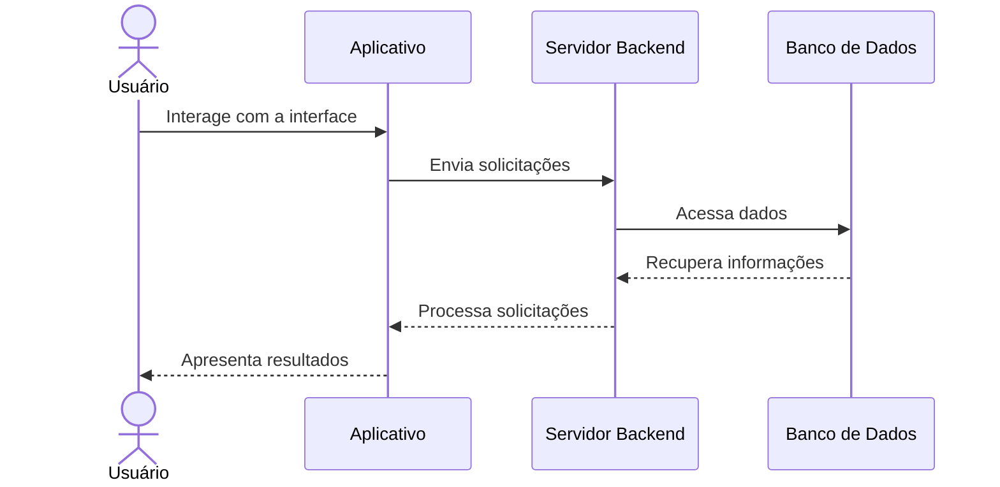
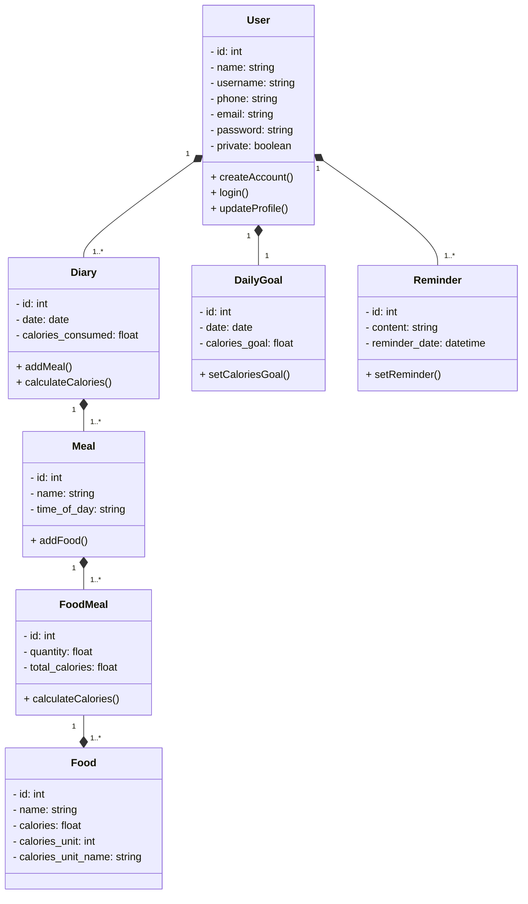
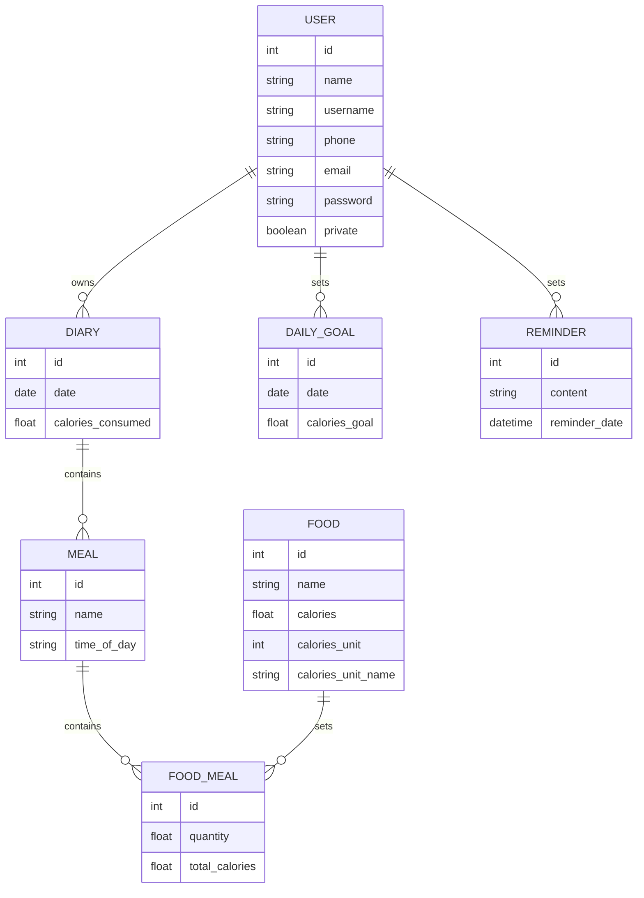
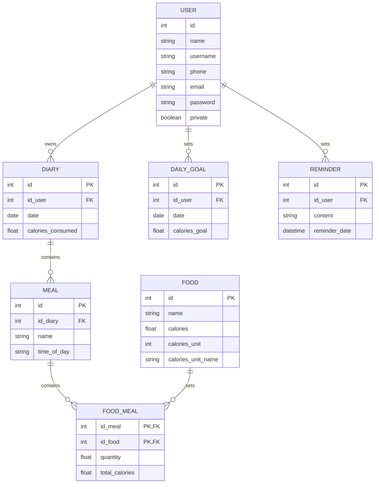

# Arquitetura da Solução

Definição de como o software é estruturado em termos dos componentes que fazem parte da solução e do ambiente de hospedagem da aplicação.

## Diagrama de Classes

O diagrama de classes ilustra graficamente como será a estrutura do software, e como cada uma das classes da sua estrutura estarão interligadas. Essas classes servem de modelo para materializar os objetos que executarão na memória.

## Modelo ER

O Modelo ER representa através de um diagrama como as entidades (coisas, objetos) se relacionam entre si na aplicação interativa.]

## Esquema Relacional

O Esquema Relacional corresponde à representação dos dados em tabelas juntamente com as restrições de integridade e chave primária.
 

## Modelo Físico

Entregar um arquivo banco.sql contendo os scripts de criação das tabelas do banco de dados. Este arquivo deverá ser incluído dentro da pasta src\bd.

## Tecnologias Utilizadas

1.  **Linguagem de Programação**:
    -   React Native: Para o desenvolvimento de aplicativos móveis multiplataforma.

2.  **Banco de Dados**:
    -   Firebase: Para armazenar dados de usuários, planos alimentares, alimentos, metas, registros de alimentos, etc.
   
3.  **Autenticação**:
    -   Firebase Authentication: Para gerenciar a autenticação de usuários com segurança.
    
4.  **IDE de Desenvolvimento**:
    -   Visual Studio Code: Uma IDE popular para o desenvolvimento React Native.
    
5.  **Framework**:
    -   React Native: Para o desenvolvimento de interfaces de usuário móveis.
    
6.  **Bibliotecas**:
    -   Redux: Para gerenciamento de estado no aplicativo.
    -   React Navigation: Para a navegação entre telas no aplicativo.
  
7.  **Ferramentas de Design**:
    -   Figma: Para criar protótipos e layouts de interface de usuário.
  

## Hospedagem

O aplicativo **Eat Smart** será hospedado e lançado no Firebase. 
Primeiro, configuramos um projeto Firebase e vinculamos nosso aplicativo React Native a ele. 

Utilizamos o Firebase Hosting para implantar o aplicativo e garantir que ele seja acessível aos usuários. Além disso, aproveitamos os recursos de segurança do Firebase, como autenticação de usuários e configurações de segurança, para proteger os dados e a comunicação. Após o lançamento, implementamos estratégias de marketing para atrair usuários e continuamos a oferecer suporte e atualizações para melhorar a experiência do usuário. O Firebase simplificou o processo de hospedagem e permitiu um lançamento suave do aplicativo "Meal Planner".

## Qualidade de Software

Conceituar qualidade de fato é uma tarefa complexa, mas ela pode ser vista como um método gerencial que através de procedimentos disseminados por toda a organização, busca garantir um produto final que satisfaça às expectativas dos stakeholders.

No contexto de desenvolvimento de software, qualidade pode ser entendida como um conjunto de características a serem satisfeitas, de modo que o produto de software atenda às necessidades de seus usuários. Entretanto, tal nível de satisfação nem sempre é alcançado de forma espontânea, devendo ser continuamente construído. Assim, a qualidade do produto depende fortemente do seu respectivo processo de desenvolvimento.

A norma internacional ISO/IEC 25010, que é uma atualização da ISO/IEC 9126, define oito características e 30 subcaracterísticas de qualidade para produtos de software.

| **Característica** | **Subcaracterística** | **Justificativa** | **Métricas** |
|---------------------|------------------------|--------------------|--------------|
| Funcionalidade | Adequação | Essencial para o planejamento de refeições precisas. | Taxa de acertos no cálculo de calorias, número de recursos essenciais implementados. |
| Usabilidade | Compreensibilidade | Usuários devem entender facilmente como usar o app. | Taxa de conclusão de tarefas de registro de alimentos, tempo médio para aprendizado. |
| Confiabilidade | Tolerância a Falhas | Evitar perda de dados. | Tempo médio de indisponibilidade, capacidade de recuperação de dados em falhas. |
| Eficiência | Tempo de Resposta | Respostas rápidas são essenciais. | Tempo médio de resposta para ações comuns, como adicionar um alimento ao plano. |
| Manutenibilidade | Modularidade | Facilita a manutenção e expansão. | Facilidade de adicionar/modificar funcionalidades sem afetar outras partes do app. |
| Portabilidade | Adaptabilidade | Funcionamento em diferentes dispositivos. | Testes bem-sucedidos em dispositivos e sistemas operacionais diferentes. |

